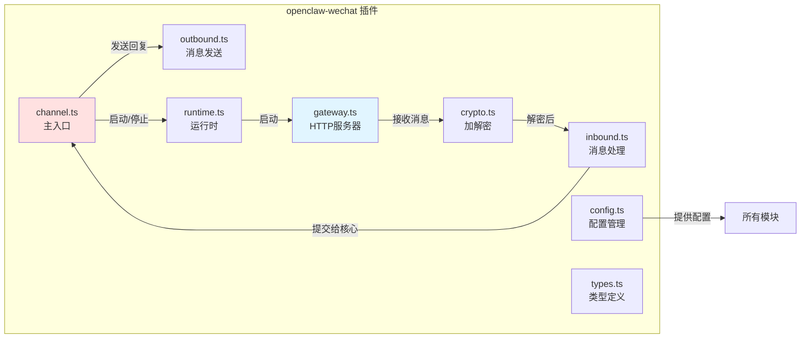
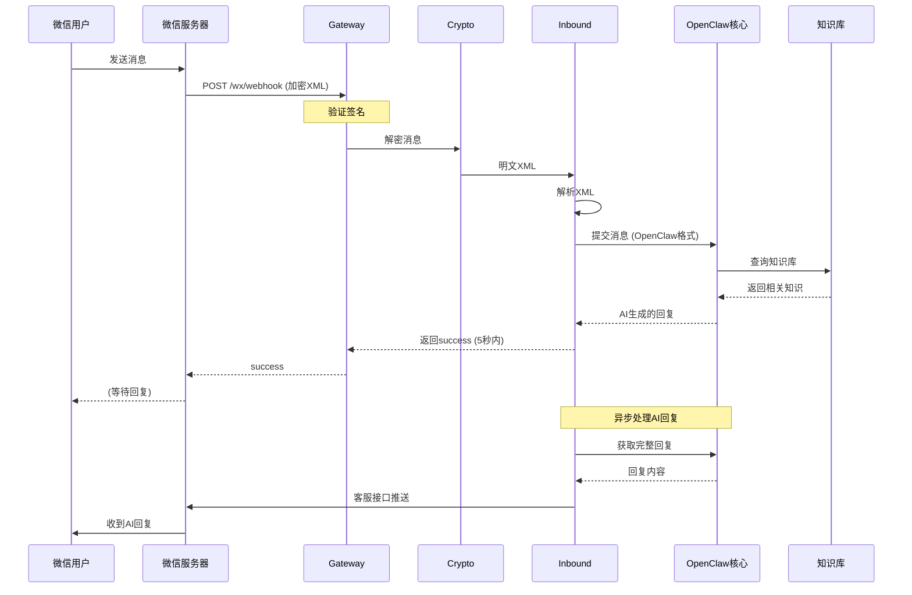
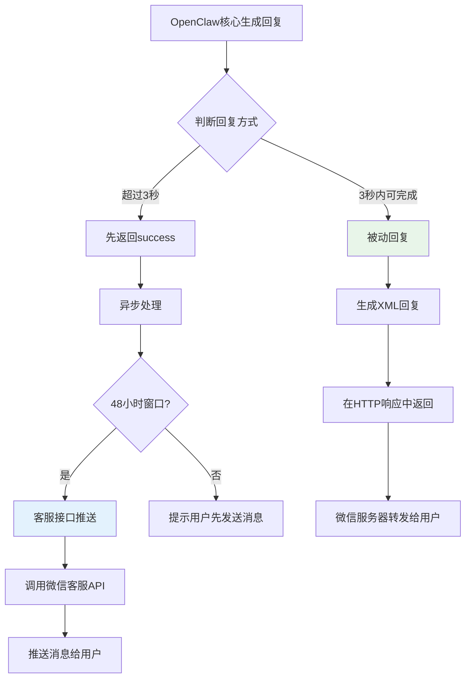
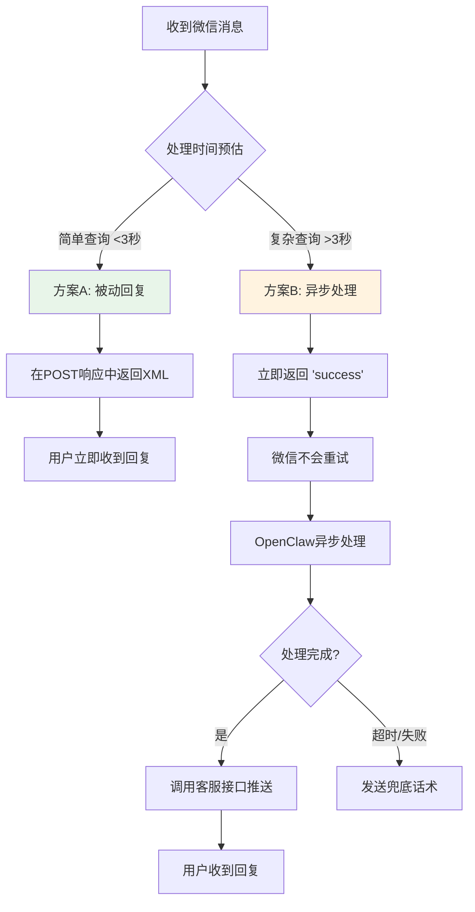
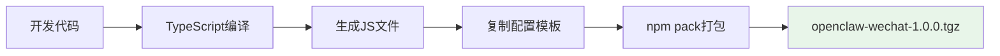
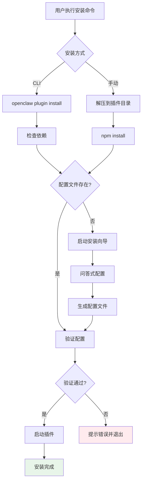
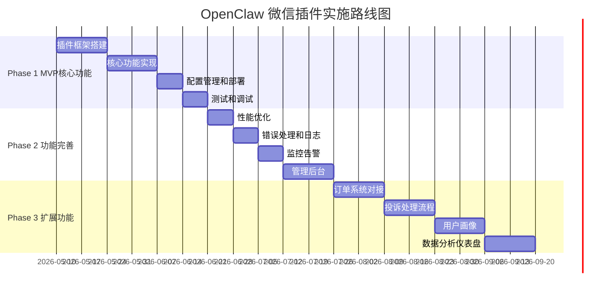

# OpenClaw 微信公众号客服助手 - 插件架构设计文档

**文档版本**: v1.0  
**撰写人**: 高见远 (Gao) - 架构师  
**日期**: 2026-05-09  
**项目代号**: OpenClaw

---

## 目录

1. [系统架构设计](#一系统架构设计)
2. [插件架构设计](#二插件架构设计)
3. [消息流转设计](#三消息流转设计)
4. [配置管理设计](#四配置管理设计)
5. [部署方案设计](#五部署方案设计)
6. [数据库设计](#六数据库设计)
7. [接口设计](#七接口设计)
8. [安全和合规](#八安全和合规)
9. [性能和可靠性](#九性能和可靠性)
10. [实施路线图](#十实施路线图)

---

## 一、系统架构设计

### 1.1 整体系统架构图（2.0版本）


**2.0版本关键变更**：
- OAGateway 与 OpenClaw 部署在同一台服务器
- 本地通信（localhost），避免网络复杂性
- 简化防火墙配置，提升安全性

### 1.2 插件模块结构图



### 1.3 技术栈总览

| 层级 | 技术选型 | 说明 |
|------|----------|------|
| **插件运行时** | Node.js 18+ | 与OpenClaw核心一致 |
| **开发语言** | TypeScript 5+ | 类型安全，易维护 |
| **HTTP服务器** | Express 4.x | 轻量级，生态丰富 |
| **XML处理** | xml2js | 解析微信消息 |
| **HTTP客户端** | axios | 调用微信API |
| **配置管理** | dotenv + JSON | 环境变量 + 配置文件 |
| **数据存储** | mysql2 + redis | 关系型 + 缓存 |
| **加解密** | crypto (Node.js内置) | AES-256-CBC |
| **日志** | winston | 结构化日志 |
| **测试** | Jest | 单元测试 + 集成测试 |

---

## 二、插件架构设计

### 2.1 文件结构

```
openclaw-wechat/
├── openclaw.plugin.json          # 插件元数据
├── package.json                  # npm包描述
├── tsconfig.json                 # TypeScript配置
├── README.md                     # 安装使用说明
├── src/
│   ├── channel.ts                # 主入口 (ChannelPlugin接口)
│   ├── gateway.ts                # HTTP服务器 (接收微信推送)
│   ├── crypto.ts                 # 消息加解密 (AES-256-CBC)
│   ├── inbound.ts                # 接收消息处理 (XML→OpenClaw)
│   ├── outbound.ts               # 发送消息 (OpenClaw→微信)
│   ├── config.ts                 # 配置管理
│   ├── runtime.ts                # 运行时管理
│   ├── types.ts                  # TypeScript类型定义
│   ├── wechat-api.ts             # 微信API封装
│   └── utils/
│       ├── signature.ts          # 签名验证
│       ├── xml-parser.ts         # XML解析工具
│       └── logger.ts             # 日志工具
├── config/
│   ├── wechat-config.template.json   # 配置模板
│   └── .env.wechat.template         # 环境变量模板
├── scripts/
│   ├── install-wizard.ts        # 安装向导
│   ├── post-install.ts          # 安装后脚本
│   └── validate-config.ts       # 配置验证
├── dist/                         # 编译输出
└── tests/                        # 测试文件
```

### 2.2 核心模块详细设计

#### 2.2.1 channel.ts - 主入口 (ChannelPlugin接口)

```typescript
// src/channel.ts
import { ChannelPlugin, Account, InboundMessage, OutboundTarget } from "openclaw/plugin-sdk";
import { WeChatConfig, WeChatAccount } from "./types";
import { loadConfig } from "./config";
import { startGateway, stopGateway } from "./gateway";
import { sendMessage } from "./outbound";
import { submitInboundMessage } from "./inbound";

export interface WeChatAccount extends Account {
  id: string;
  appId: string;
  appSecret: string;
  token: string;
  encodingAESKey: string;
  port: number;
}

export const wechatPlugin: ChannelPlugin<WeChatAccount> = {
  id: "wechat",
  meta: {
    id: "wechat",
    label: "WeChat Official Account",
    selectionLabel: "微信公众号",
    docsPath: "/docs/channels/wechat",
    blurb: "连接微信公众号，实现智能客服",
    logo: "wechat-logo.png",
    order: 60,
  },
  
  capabilities: {
    chatTypes: ["direct"],           // 服务号支持单聊
    media: true,                     // 支持图片/语音
    reactions: false,
    threads: false,
    blockStreaming: true,            // 不支持流式输出
    knowledgeBase: true,             // 支持知识库
  },
  
  // ========== 账户管理 ==========
  accounts: {
    resolveAccount: (cfg: WeChatConfig, accountId: string): WeChatAccount | null => {
      const config = cfg.wechat;
      if (!config) return null;
      
      return {
        id: accountId || "default",
        appId: config.appId,
        appSecret: config.appSecret,
        token: config.token,
        encodingAESKey: config.encodingAESKey,
        port: cfg.server.port,
      };
    },
    
    defaultAccountId: (cfg: WeChatConfig): string => {
      return "default";
    },
    
    isConfigured: (account: WeChatAccount): boolean => {
      return Boolean(
        account?.appId && 
        account?.appSecret && 
        account?.token && 
        account?.encodingAESKey
      );
    },
    
    listAccounts: (cfg: WeChatConfig): string[] => {
      return ["default"];
    },
  },
  
  // ========== 消息发送 ==========
  deliver: async ({ 
    account, 
    target, 
    content,
    messageType = "text",
  }: {
    account: WeChatAccount;
    target: OutboundTarget;
    content: string;
    messageType?: string;
  }) => {
    try {
      const result = await sendMessage(account, target, content, messageType);
      return { success: true, messageId: result.messageId };
    } catch (error) {
      return { success: false, error: error.message };
    }
  },
  
  // ========== 生命周期管理 ==========
  startAccount: async ({ account }: { account: WeChatAccount }) => {
    try {
      const gateway = await startGateway(account);
      return { success: true, gateway };
    } catch (error) {
      throw new Error(`启动微信插件失败: ${error.message}`);
    }
  },
  
  stopAccount: async ({ account }: { account: WeChatAccount }) => {
    try {
      await stopGateway(account);
      return { success: true };
    } catch (error) {
      throw new Error(`停止微信插件失败: ${error.message}`);
    }
  },
  
  // ========== 接收消息处理 ==========
  onInbound: async ({ account, rawMessage }: { account: WeChatAccount; rawMessage: any }) => {
    // 由gateway直接调用OpenClaw核心，此函数用于格式转换
    return submitInboundMessage(account, rawMessage);
  },
};

export default wechatPlugin;
```

#### 2.2.2 gateway.ts - HTTP服务器

```typescript
// src/gateway.ts
import express, { Application, Request, Response } from "express";
import crypto from "crypto";
import { WeChatAccount } from "./types";
import { decryptMessage, encryptMessage } from "./crypto";
import { parseWeChatXML } from "./utils/xml-parser";
import { verifySignature } from "./utils/signature";
import { submitToOpenClaw } from "./inbound";
import { loadConfig } from "./config";
import { logger } from "./utils/logger";

let serverInstance: any = null;

export async function startGateway(account: WeChatAccount): Promise<{ server: any; dispose: () => Promise<void> }> {
  const app: Application = express();
  const config = loadConfig();
  
  // 解析原始Body（用于XML解密）
  app.use(express.raw({ type: "text/xml", limit: "1mb" }));
  app.use(express.json());
  
  // ========== 1. 微信服务器验证 (首次配置) ==========
  app.get("/wx/webhook", (req: Request, res: Response) => {
    const { signature, timestamp, nonce, echostr } = req.query;
    
    logger.info("收到微信服务器验证请求", { timestamp, nonce });
    
    // 验证签名
    if (!verifySignature(account.token, timestamp as string, nonce as string, signature as string)) {
      logger.warn("微信服务器验证失败：签名不匹配");
      return res.status(403).send("Forbidden");
    }
    
    // 验证通过，返回echostr
    logger.info("微信服务器验证成功");
    res.send(echostr);
  });
  
  // ========== 2. 接收消息推送 ==========
  app.post("/wx/webhook", async (req: Request, res: Response) => {
    const startTime = Date.now();
    
    try {
      // 1. 验证签名
      const { signature, timestamp, nonce } = req.query;
      if (!verifySignature(account.token, timestamp as string, nonce as string, signature as string)) {
        logger.warn("消息签名验证失败");
        return res.status(403).send("Forbidden");
      }
      
      // 2. 解密消息 (安全模式)
      const encryptedData = req.body;
      const decryptedXML = decryptMessage(encryptedData, account.encodingAESKey);
      
      // 3. 解析XML
      const message = parseWeChatXML(decryptedXML);
      logger.info("收到微信消息", { 
        openid: message.FromUserName, 
        msgType: message.MsgType,
        content: message.Content,
      });
      
      // 4. 立即返回success (5秒超时处理)
      res.send("success");
      
      // 5. 异步处理消息 (不阻塞响应)
      setImmediate(async () => {
        try {
          await submitToOpenClaw(account, message);
          const processingTime = Date.now() - startTime;
          logger.info(`消息处理完成，耗时: ${processingTime}ms`);
        } catch (error) {
          logger.error("消息处理失败", { error: error.message, stack: error.stack });
        }
      });
      
    } catch (error) {
      logger.error("处理微信消息异常", { error: error.message });
      // 异常时也返回success，避免微信重试
      if (!res.headersSent) {
        res.send("success");
      }
    }
  });
  
  // ========== 3. 健康检查 ==========
  app.get("/health", (req: Request, res: Response) => {
    res.json({ 
      status: "ok", 
      timestamp: new Date().toISOString(),
      account: account.id,
    });
  });
  
  // 启动服务器
  const port = account.port || 8080;
  const server = app.listen(port, "0.0.0.0", () => {
    logger.info(`微信插件Gateway启动成功`, { port, path: "/wx/webhook" });
  });
  
  serverInstance = server;
  
  return {
    server,
    dispose: async () => {
      return new Promise<void>((resolve) => {
        server.close(() => {
          logger.info("微信插件Gateway已停止");
          resolve();
        });
      });
    },
  };
}

export async function stopGateway(account: WeChatAccount): Promise<void> {
  if (serverInstance) {
    serverInstance.close();
    serverInstance = null;
  }
}
```

#### 2.2.3 crypto.ts - 消息加解密

```typescript
// src/crypto.ts
import crypto from "crypto";

/**
 * 微信消息加解密 (AES-256-CBC)
 * 
 * 加密流程:
 * 1. 随机生成16字节字符串
 * 2. 拼接: random(16B) + msg_len(4B) + msg_content + appid
 * 3. AES-256-CBC加密
 * 4. Base64编码
 * 
 * 解密流程:
 * 1. Base64解码
 * 2. AES-256-CBC解密
 * 3. 去除随机字符串和填充
 * 4. 提取消息内容
 */

// 解密消息
export function decryptMessage(encryptedData: Buffer, encodingAESKey: string): string {
  try {
    // 1. Base64解码AESKey (43位 → 32字节)
    const key = Buffer.from(encodingAESKey + "=", "base64");
    
    // 2. IV = key的前16字节
    const iv = key.slice(0, 16);
    
    // 3. Base64解码加密数据
    const encryptedBuffer = Buffer.from(encryptedData.toString(), "base64");
    
    // 4. 创建解密器
    const decipher = crypto.createDecipheriv("aes-256-cbc", key, iv);
    decipher.setAutoPadding(false);  // 手动处理填充
    
    // 5. 解密
    let decrypted = decipher.update(encryptedBuffer);
    decrypted = Buffer.concat([decrypted, decipher.final()]);
    
    // 6. 去除PKCS7填充
    decrypted = removePKCS7Padding(decrypted);
    
    // 7. 去除随机前缀 (前16字节是随机字符串)
    const randomStrLen = 16;
    const msgLenBuf = decrypted.slice(randomStrLen, randomStrLen + 4);
    const msgLen = msgLenBuf.readUInt32BE(0);
    
    const contentStart = randomStrLen + 4;
    const contentEnd = contentStart + msgLen;
    const messageContent = decrypted.slice(contentStart, contentEnd).toString("utf-8");
    
    // 8. 验证AppID (可选)
    const appIdStart = contentEnd;
    const appId = decrypted.slice(appIdStart).toString("utf-8");
    
    return messageContent;
  } catch (error) {
    throw new Error(`消息解密失败: ${error.message}`);
  }
}

// 加密消息
export function encryptMessage(xml: string, encodingAESKey: string, appId: string): string {
  try {
    // 1. 生成16字节随机字符串
    const randomStr = crypto.randomBytes(16);
    
    // 2. 消息长度 (4字节网络字节序)
    const msgBuf = Buffer.from(xml, "utf-8");
    const msgLenBuf = Buffer.alloc(4);
    msgLenBuf.writeUInt32BE(msgBuf.length, 0);
    
    // 3. AppID
    const appIdBuf = Buffer.from(appId, "utf-8");
    
    // 4. 拼接
    const plainText = Buffer.concat([randomStr, msgLenBuf, msgBuf, appIdBuf]);
    
    // 5. PKCS7填充
    const paddedPlainText = addPKCS7Padding(plainText, 32);
    
    // 6. AES-256-CBC加密
    const key = Buffer.from(encodingAESKey + "=", "base64");
    const iv = key.slice(0, 16);
    
    const cipher = crypto.createCipheriv("aes-256-cbc", key, iv);
    cipher.setAutoPadding(false);
    
    let encrypted = cipher.update(paddedPlainText);
    encrypted = Buffer.concat([encrypted, cipher.final()]);
    
    // 7. Base64编码
    return encrypted.toString("base64");
  } catch (error) {
    throw new Error(`消息加密失败: ${error.message}`);
  }
}

// 去除PKCS7填充
function removePKCS7Padding(buf: Buffer): Buffer {
  const paddingLen = buf[buf.length - 1];
  if (paddingLen > 32) {
    throw new Error("无效的PKCS7填充");
  }
  return buf.slice(0, buf.length - paddingLen);
}

// 添加PKCS7填充
function addPKCS7Padding(buf: Buffer, blockSize: number): Buffer {
  const paddingLen = blockSize - (buf.length % blockSize);
  const padding = Buffer.alloc(paddingLen, paddingLen);
  return Buffer.concat([buf, padding]);
}
```

#### 2.2.4 inbound.ts - 接收消息处理

```typescript
// src/inbound.ts
import { WeChatAccount } from "./types";
import { parseWeChatXML, WeChatInboundMessage } from "./utils/xml-parser";
import { getAccessToken } from "./wechat-api";
import { loadConfig } from "./config";
import { logger } from "./utils/logger";

/**
 * 微信消息格式 → OpenClaw格式 转换
 */

// 提交消息给OpenClaw核心
export async function submitToOpenClaw(account: WeChatAccount, rawMessage: any): Promise<void> {
  try {
    // 1. 解析微信消息
    const message: WeChatInboundMessage = parseWeChatXML(rawMessage);
    
    // 2. 转换为OpenClaw格式
    const openclawMessage = convertToOpenClawFormat(account, message);
    
    // 3. 提交给OpenClaw核心处理
    // 注意：OpenClaw会自动维护多轮对话上下文，不需要手动管理
    const response = await callOpenClawAPI(openclawMessage);
    
    // 4. 处理OpenClaw回复
    await handleOpenClawResponse(account, message, response);
    
  } catch (error) {
    logger.error("提交消息到OpenClaw失败", { error: error.message });
    // 发送兜底话术
    await sendFallbackMessage(account, rawMessage.FromUserName);
  }
}

// 转换为OpenClaw格式
function convertToOpenClawFormat(account: WeChatAccount, message: WeChatInboundMessage): OpenClawInboundRequest {
  const config = loadConfig();
  
  return {
    // 用户标识 (OpenID)
    userId: message.FromUserName,
    
    // 消息内容
    message: message.Content || "",
    messageType: mapMessageType(message.MsgType),
    
    // 媒体内容 (如果是图片/语音)
    mediaUrl: message.MediaUrl || "",
    
    // 知识库ID (从配置读取)
    knowledgeBaseId: config.openclaw.knowledgeBaseId,
    
    // 会话ID (用于多轮对话，OpenClaw自动维护)
    sessionId: `wechat_${message.FromUserName}`,
    
    // 附加信息
    metadata: {
      channel: "wechat",
      msgId: message.MsgId,
      createTime: message.CreateTime,
    },
  };
}

// 调用OpenClaw API
async function callOpenClawAPI(request: OpenClawInboundRequest): Promise<OpenClawResponse> {
  const config = loadConfig();
  
  // OpenClaw API调用
  // 注意：根据OpenClaw团队回复，API会按照微信平台要求定制开发
  const apiUrl = `https://${config.server.host}/api/wechat/chat`;  // 示例URL
  
  const response = await fetch(apiUrl, {
    method: "POST",
    headers: {
      "Content-Type": "application/json",
    },
    body: JSON.stringify(request),
    // 设置超时 (10秒，根据OpenClaw回复)
    signal: AbortSignal.timeout(config.openclaw.apiTimeout || 10000),
  });
  
  if (!response.ok) {
    throw new Error(`OpenClaw API调用失败: ${response.status} ${response.statusText}`);
  }
  
  return await response.json();
}

// 处理OpenClaw回复
async function handleOpenClawResponse(
  account: WeChatAccount, 
  originalMessage: WeChatInboundMessage,
  openclawResponse: OpenClawResponse
): Promise<void> {
  const replyContent = openclawResponse.reply || openclawResponse.content || "";
  
  if (!replyContent) {
    logger.warn("OpenClaw返回空回复");
    return;
  }
  
  // 判断使用哪种方式回复
  const usePassiveReply = shouldUsePassiveReply(originalMessage);
  
  if (usePassiveReply) {
    // 方案A: 被动回复 (需要在5秒内返回XML)
    // 注意：此路径需要在gateway中直接处理，不能异步
    logger.info("使用被动回复");
    // 被动回复需要在POST请求的响应中返回XML，此处仅记录
  } else {
    // 方案B: 客服接口异步回复
    logger.info("使用客服接口回复");
    await sendViaCustomService(account, originalMessage.FromUserName, replyContent);
  }
}

// 判断是否需要使用客服接口 (超过5秒或无法被动回复)
function shouldUsePassiveReply(message: WeChatInboundMessage): boolean {
  // 被动回复仅支持: text, image, voice, video, music, news
  const passiveSupportedTypes = ["text", "image", "voice", "video", "music", "news"];
  return passiveSupportedTypes.includes(message.MsgType);
}

// 通过客服接口发送
async function sendViaCustomService(account: WeChatAccount, openid: string, content: string): Promise<void> {
  const accessToken = await getAccessToken(account);
  const apiUrl = `https://api.weixin.qq.com/cgi-bin/message/custom/send?access_token=${accessToken}`;
  
  const response = await fetch(apiUrl, {
    method: "POST",
    headers: { "Content-Type": "application/json" },
    body: JSON.stringify({
      touser: openid,
      msgtype: "text",
      text: { content },
    }),
  });
  
  if (!response.ok) {
    const error = await response.json();
    throw new Error(`客服接口调用失败: ${error.errmsg}`);
  }
}

// 发送兜底话术
async function sendFallbackMessage(account: WeChatAccount, openid: string): Promise<void> {
  const fallbackMessage = "抱歉，系统暂时无法处理您的请求，请稍后再试或联系人工客服。";
  await sendViaCustomService(account, openid, fallbackMessage);
}

// 类型映射
function mapMessageType(wechatMsgType: string): string {
  const typeMap: Record<string, string> = {
    "text": "text",
    "image": "image",
    "voice": "voice",
    "video": "video",
    "shortvideo": "video",
    "location": "location",
    "link": "link",
  };
  return typeMap[wechatMsgType] || "text";
}

// ========== 类型定义 ==========
interface OpenClawInboundRequest {
  userId: string;
  message: string;
  messageType: string;
  mediaUrl?: string;
  knowledgeBaseId: string;
  sessionId: string;
  metadata?: Record<string, any>;
}

interface OpenClawResponse {
  reply?: string;
  content?: string;
  messageId?: string;
  [key: string]: any;
}
```

#### 2.2.5 outbound.ts - 发送消息

```typescript
// src/outbound.ts
import { WeChatAccount } from "./types";
import { getAccessToken } from "./wechat-api";
import { encryptMessage } from "./crypto";
import { loadConfig } from "./config";
import { logger } from "./utils/logger";

/**
 * 发送消息到微信
 * 支持两种方式:
 * 1. 被动回复 (Passive Reply) - 在5秒窗口内直接返回XML
 * 2. 客服接口 (Custom Service API) - 在48小时窗口内异步推送
 */

// 发送消息 (主入口)
export async function sendMessage(
  account: WeChatAccount,
  target: { openid: string },
  content: string,
  messageType: string = "text"
): Promise<{ messageId: string }> {
  try {
    // 判断使用哪种发送方式
    // 优先使用客服接口 (更灵活，支持更多类型)
    const result = await sendViaCustomService(account, target.openid, content, messageType);
    return result;
  } catch (error) {
    logger.error("发送消息失败", { error: error.message, openid: target.openid });
    throw error;
  }
}

// 通过客服接口发送
async function sendViaCustomService(
  account: WeChatAccount,
  openid: string,
  content: string,
  messageType: string = "text"
): Promise<{ messageId: string }> {
  const accessToken = await getAccessToken(account);
  const apiUrl = `https://api.weixin.qq.com/cgi-bin/message/custom/send?access_token=${accessToken}`;
  
  let messageBody: any = {
    touser: openid,
    msgtype: mapToWeChatMsgType(messageType),
  };
  
  // 根据消息类型构建body
  switch (messageType) {
    case "text":
      messageBody.text = { content };
      break;
    case "image":
      messageBody.image = { media_id: content };
      break;
    case "voice":
      messageBody.voice = { media_id: content };
      break;
    case "video":
      messageBody.video = { media_id: content };
      break;
    case "news":
      messageBody.news = JSON.parse(content);
      break;
    default:
      messageBody.text = { content };
  }
  
  const response = await fetch(apiUrl, {
    method: "POST",
    headers: { "Content-Type": "application/json" },
    body: JSON.stringify(messageBody),
  });
  
  const result = await response.json();
  
  if (result.errcode !== 0) {
    // 处理常见错误
    if (result.errcode === 45015) {
      // 48小时窗口过期
      throw new Error("用户已超过48小时未互动，无法主动推送消息");
    }
    throw new Error(`客服接口错误: ${result.errmsg}`);
  }
  
  return { messageId: result.msgid || `${Date.now()}` };
}

// 生成被动回复XML (用于5秒窗口内的同步回复)
export function generatePassiveReplyXML(
  account: WeChatAccount,
  toOpenid: string,
  fromOpenid: string,
  content: string,
  messageType: string = "text"
): string {
  const timestamp = Math.floor(Date.now() / 1000);
  
  let xmlContent = "";
  switch (messageType) {
    case "text":
      xmlContent = `
        <xml>
          <ToUserName><![CDATA[${toOpenid}]]></ToUserName>
          <FromUserName><![CDATA[${fromOpenid}]]></FromUserName>
          <CreateTime>${timestamp}</CreateTime>
          <MsgType><![CDATA[text]]></MsgType>
          <Content><![CDATA[${content}]]></Content>
        </xml>
      `;
      break;
    // 其他类型...
  }
  
  // 如果需要加密 (安全模式)，则加密XML
  const config = require("./config").loadConfig();
  if (config.wechat.encodingAESKey) {
    return encryptMessage(xmlContent, account.encodingAESKey, account.appId);
  }
  
  return xmlContent;
}

// 消息类型映射
function mapToWeChatMsgType(type: string): string {
  const typeMap: Record<string, string> = {
    "text": "text",
    "image": "image",
    "voice": "voice",
    "video": "video",
    "music": "music",
    "news": "news",
  };
  return typeMap[type] || "text";
}
```

#### 2.2.6 config.ts - 配置管理

```typescript
// src/config.ts
import fs from "fs";
import path from "path";
import dotenv from "dotenv";

// 加载环境变量
dotenv.config({ path: path.join(__dirname, "../config/.env.wechat") });

export interface WeChatConfig {
  server: {
    host: string;
    port: number;
    publicUrl: string;
  };
  wechat: {
    appId: string;
    appSecret: string;
    token: string;
    encodingAESKey: string;
  };
  openclaw: {
    knowledgeBaseId: string;
    apiTimeout: number;
  };
}

let cachedConfig: WeChatConfig | null = null;

// 加载配置
export function loadConfig(): WeChatConfig {
  if (cachedConfig) {
    return cachedConfig;
  }
  
  // 1. 从环境变量读取敏感信息
  const config: WeChatConfig = {
    server: {
      host: process.env.SERVER_HOST || "0.0.0.0",
      port: parseInt(process.env.SERVER_PORT || "8080"),
      publicUrl: process.env.SERVER_PUBLIC_URL || "",
    },
    wechat: {
      appId: process.env.WECHAT_APP_ID || "",
      appSecret: process.env.WECHAT_APP_SECRET || "",
      token: process.env.WECHAT_TOKEN || "",
      encodingAESKey: process.env.WECHAT_ENCODING_AES_KEY || "",
    },
    openclaw: {
      knowledgeBaseId: process.env.OPENCLAW_KNOWLEDGE_BASE_ID || "",
      apiTimeout: parseInt(process.env.OPENCLAW_API_TIMEOUT || "10000"),
    },
  };
  
  // 2. 验证配置
  validateConfig(config);
  
  cachedConfig = config;
  return config;
}

// 验证配置
function validateConfig(config: WeChatConfig): void {
  const errors: string[] = [];
  
  // 验证必填项
  if (!config.wechat.appId) errors.push("wechat.appId 不能为空");
  if (!config.wechat.appSecret) errors.push("wechat.appSecret 不能为空");
  if (!config.wechat.token) errors.push("wechat.token 不能为空");
  if (!config.wechat.encodingAESKey) errors.push("wechat.encodingAESKey 不能为空");
  if (config.wechat.encodingAESKey.length !== 43) errors.push("wechat.encodingAESKey 必须是43位");
  
  if (!config.openclaw.knowledgeBaseId) errors.push("openclaw.knowledgeBaseId 不能为空");
  
  if (errors.length > 0) {
    throw new Error(`配置验证失败:\n${errors.join("\n")}`);
  }
}

// 清除缓存 (用于配置更新后重新加载)
export function reloadConfig(): void {
  cachedConfig = null;
}
```

#### 2.2.7 runtime.ts - 运行时管理

```typescript
// src/runtime.ts
import { WeChatAccount } from "./types";
import { startGateway, stopGateway } from "./gateway";
import { loadConfig } from "./config";
import { logger } from "./utils/logger";

let activeGateways: Map<string, any> = new Map();

// 启动插件
export async function startPlugin(account: WeChatAccount): Promise<void> {
  try {
    logger.info("启动微信插件...", { accountId: account.id });
    
    // 1. 加载配置
    const config = loadConfig();
    logger.info("配置加载成功");
    
    // 2. 启动Gateway
    const gateway = await startGateway(account);
    activeGateways.set(account.id, gateway);
    
    // 3. 初始化微信API (获取access_token)
    // await initWeChatAPI(account);
    
    logger.info("微信插件启动成功");
  } catch (error) {
    logger.error("微信插件启动失败", { error: error.message });
    throw error;
  }
}

// 停止插件
export async function stopPlugin(account: WeChatAccount): Promise<void> {
  try {
    logger.info("停止微信插件...", { accountId: account.id });
    
    // 1. 停止Gateway
    const gateway = activeGateways.get(account.id);
    if (gateway) {
      await gateway.dispose();
      activeGateways.delete(account.id);
    }
    
    logger.info("微信插件已停止");
  } catch (error) {
    logger.error("微信插件停止失败", { error: error.message });
    throw error;
  }
}

// 健康检查
export function healthCheck(): { status: string; details: any } {
  return {
    status: activeGateways.size > 0 ? "running" : "stopped",
    details: {
      activeGateways: Array.from(activeGateways.keys()),
      timestamp: new Date().toISOString(),
    },
  };
}
```

---

## 三、消息流转设计

### 3.1 流程1：接收用户消息



### 3.2 流程2：发送AI回复



### 3.3 流程3：5秒超时处理



---

## 四、配置管理设计

### 4.1 配置文件结构

**主配置文件**: `config/wechat-config.json`

```json
{
  "version": "1.0.0",
  "lastUpdated": "2026-05-09T12:00:00Z",
  "server": {
    "host": "0.0.0.0",
    "port": 8080,
    "publicUrl": "https://openclaw.yourdomain.com/wx/webhook"
  },
  "wechat": {
    "appId": "wx1234567890abcdef",
    "appSecret": "${WECHAT_APP_SECRET}",
    "token": "openclaw2026",
    "encodingAESKey": "${WECHAT_ENCODING_AES_KEY}"
  },
  "openclaw": {
    "knowledgeBaseId": "kb-wechat-products",
    "apiTimeout": 10000
  }
}
```

**环境变量文件**: `config/.env.wechat`

```bash
# 服务器配置
SERVER_HOST=0.0.0.0
SERVER_PORT=8080
SERVER_PUBLIC_URL=https://openclaw.yourdomain.com/wx/webhook

# 微信公众号配置 (敏感信息)
WECHAT_APP_ID=wx1234567890abcdef
WECHAT_APP_SECRET=your-app-secret-here
WECHAT_TOKEN=openclaw2026
WECHAT_ENCODING_AES_KEY=your-43-char-encoding-aes-key-here

# OpenClaw配置
OPENCLAW_KNOWLEDGE_BASE_ID=kb-wechat-products
OPENCLAW_API_TIMEOUT=10000
```

### 4.2 配置验证 Schema

```json
{
  "$schema": "http://json-schema.org/draft-07/schema#",
  "type": "object",
  "required": ["version", "server", "wechat", "openclaw"],
  "properties": {
    "version": { "type": "string", "pattern": "^\\d+\\.\\d+\\.\\d+$" },
    "server": {
      "type": "object",
      "required": ["host", "port", "publicUrl"],
      "properties": {
        "host": { "type": "string" },
        "port": { "type": "number", "minimum": 1, "maximum": 65535 },
        "publicUrl": { "type": "string", "format": "uri" }
      }
    },
    "wechat": {
      "type": "object",
      "required": ["appId", "appSecret", "token", "encodingAESKey"],
      "properties": {
        "appId": { "type": "string", "minLength": 1 },
        "appSecret": { "type": "string", "minLength": 1 },
        "token": { "type": "string", "minLength": 3, "maxLength": 32 },
        "encodingAESKey": { "type": "string", "minLength": 43, "maxLength": 43 }
      }
    },
    "openclaw": {
      "type": "object",
      "required": ["knowledgeBaseId"],
      "properties": {
        "knowledgeBaseId": { "type": "string", "minLength": 1 },
        "apiTimeout": { "type": "number", "minimum": 1000, "default": 10000 }
      }
    }
  }
}
```

### 4.3 .gitignore 配置

```gitignore
# 忽略实际配置文件 (包含敏感信息)
config/wechat-config.json
config/.env.wechat

# 保留模板文件
!config/wechat-config.template.json
!config/.env.wechat.template

# 忽略日志文件
*.log
logs/

# 忽略编译输出
dist/
```

---

## 五、部署方案设计

### 5.1 插件打包流程



### 5.2 安装流程



### 5.3 安装向导交互设计

```
┌─────────────────────────────────────────────────────────┐
│                                                         │
│   📦 OpenClaw 微信公众号插件 - 安装向导                   │
│                                                         │
│   欢迎！此向导将帮助您完成插件配置。                      │
│   预计需要 3-5 分钟。                                   │
│                                                         │
└─────────────────────────────────────────────────────────┘

【步骤 1/3】服务器配置
─────────────────────────────────────────────────────────

服务器监听地址 [默认: 0.0.0.0]: ████████████████████████

服务器端口 [默认: 8080]: ████████████████████████

公网可访问的URL: https://openclaw.yourdomain.com/wx/webhook
┌─────────────────────────────────────────────────────────┐
│                                                         │
│   ✅ 提示：此URL需要配置到微信公众平台 > 基本配置        │
│                                                         │
└─────────────────────────────────────────────────────────┘


【步骤 2/3】微信公众号配置
─────────────────────────────────────────────────────────

微信公众号 AppID: wx1234567890abcdef███████████████████████

微信公众号 AppSecret: ████████████████████████████████████

开发者 Token [随机生成]: openclaw-xxxxxxxxxxxxxxxxxxxxxx

消息加解密密钥 [随机生成]: xxxxxxxxxxxxxxxxxxxxxxxxxxxxxxx

┌─────────────────────────────────────────────────────────┐
│                                                         │
│   ⚠️  请妥善保管 AppSecret 和 EncodingAESKey             │
│   这些信息将保存到 config/.env.wechat (已加入.gitignore) │
│                                                         │
└─────────────────────────────────────────────────────────┘


【步骤 3/3】OpenClaw 配置
─────────────────────────────────────────────────────────

知识库 ID: kb-wechat-products████████████████████████████

API 超时时间(毫秒) [默认: 10000]: ████████████████████████


┌─────────────────────────────────────────────────────────┐
│                                                         │
│   ✅ 配置完成！                                          │
│                                                         │
│   配置文件已生成:                                         │
│   - config/wechat-config.json                           │
│   - config/.env.wechat                                  │
│                                                         │
│   接下来请在微信公众平台完成配置:                         │
│   1. 登录 https://mp.weixin.qq.com/                     │
│   2. 进入"设置与开发" > "基本配置"                       │
│   3. 点击"修改配置"                                      │
│   4. 填写 URL、Token、EncodingAESKey                    │
│   5. 启用服务器配置                                      │
│                                                         │
└─────────────────────────────────────────────────────────┘
```

---

## 六、数据库设计

### 6.1 会话记录表 (wechat_sessions)

```sql
CREATE TABLE wechat_sessions (
    session_id VARCHAR(64) PRIMARY KEY COMMENT '会话ID (wechat_OPENID)',
    openid VARCHAR(64) NOT NULL COMMENT '用户OpenID',
    start_time DATETIME NOT NULL COMMENT '会话开始时间',
    last_active_time DATETIME NOT NULL COMMENT '最后活跃时间',
    message_count INT DEFAULT 0 COMMENT '消息数量',
    status ENUM('active', 'inactive') DEFAULT 'active' COMMENT '会话状态',
    created_at TIMESTAMP DEFAULT CURRENT_TIMESTAMP,
    updated_at TIMESTAMP DEFAULT CURRENT_TIMESTAMP ON UPDATE CURRENT_TIMESTAMP,
    
    INDEX idx_openid (openid),
    INDEX idx_last_active (last_active_time)
) ENGINE=InnoDB DEFAULT CHARSET=utf8mb4 COMMENT='微信会话记录表';
```

### 6.2 消息日志表 (wechat_messages)

```sql
CREATE TABLE wechat_messages (
    id BIGINT AUTO_INCREMENT PRIMARY KEY COMMENT '自增ID',
    msg_id VARCHAR(64) COMMENT '微信消息ID',
    session_id VARCHAR(64) NOT NULL COMMENT '会话ID',
    openid VARCHAR(64) NOT NULL COMMENT '用户OpenID',
    direction ENUM('inbound', 'outbound') NOT NULL COMMENT '消息方向',
    msg_type VARCHAR(32) NOT NULL COMMENT '消息类型',
    content TEXT COMMENT '消息内容',
    media_url VARCHAR(512) COMMENT '媒体URL',
    raw_data JSON COMMENT '原始数据',
    processing_time INT COMMENT '处理耗时(ms)',
    created_at TIMESTAMP DEFAULT CURRENT_TIMESTAMP,
    
    INDEX idx_session (session_id),
    INDEX idx_openid (openid),
    INDEX idx_created_at (created_at),
    FOREIGN KEY (session_id) REFERENCES wechat_sessions(session_id)
) ENGINE=InnoDB DEFAULT CHARSET=utf8mb4 COMMENT='微信消息日志表';
```

### 6.3 配置备份表 (wechat_config_backup)

```sql
CREATE TABLE wechat_config_backup (
    id INT AUTO_INCREMENT PRIMARY KEY,
    version VARCHAR(32) NOT NULL COMMENT '配置版本',
    config_data JSON NOT NULL COMMENT '配置数据',
    backup_reason VARCHAR(256) COMMENT '备份原因',
    created_at TIMESTAMP DEFAULT CURRENT_TIMESTAMP,
    
    INDEX idx_version (version),
    INDEX idx_created_at (created_at)
) ENGINE=InnoDB DEFAULT CHARSET=utf8mb4 COMMENT='配置备份表';
```

---

## 七、接口设计

### 7.1 与微信服务器的接口

#### 7.1.1 验证接口 (GET /wx/webhook)

**请求参数**:

| 参数 | 类型 | 必填 | 说明 |
|------|------|------|------|
| signature | string | 是 | 微信加密签名 |
| timestamp | string | 是 | 时间戳 |
| nonce | string | 是 | 随机数 |
| echostr | string | 是 | 随机字符串 |

**响应**:
- 成功: 返回 echostr 原文
- 失败: 返回 403 Forbidden

#### 7.1.2 消息接收接口 (POST /wx/webhook)

**请求**:
- Content-Type: text/xml
- Body: 加密的XML (安全模式)

**响应**:
- 成功: `success` (5秒内)
- 失败: 错误信息

#### 7.1.3 被动回复格式 (XML)

```xml
<xml>
  <ToUserName><![CDATA[toUser]]></ToUserName>
  <FromUserName><![CDATA[fromUser]]></FromUserName>
  <CreateTime>12345678</CreateTime>
  <MsgType><![CDATA[text]]></MsgType>
  <Content><![CDATA[回复内容]]></Content>
</xml>
```

#### 7.1.4 客服接口 (微信API)

**请求**:
```
POST https://api.weixin.qq.com/cgi-bin/message/custom/send?access_token=ACCESS_TOKEN
```

**请求体 (文本消息)**:
```json
{
    "touser": "OPENID",
    "msgtype": "text",
    "text": {
        "content": "回复内容"
    }
}
```

**响应**:
```json
{
    "errcode": 0,
    "errmsg": "ok",
    "msgid": "MESSAGE_ID"
}
```

### 7.2 与OpenClaw核心的接口

#### 7.2.1 提交消息 (Inbound)

**请求**:
```json
POST /api/wechat/chat

{
    "userId": "oABC123...",
    "message": "用户的问题",
    "messageType": "text",
    "knowledgeBaseId": "kb-wechat-products",
    "sessionId": "wechat_oABC123...",
    "metadata": {
        "channel": "wechat",
        "msgId": "1234567890"
    }
}
```

**响应**:
```json
{
    "success": true,
    "reply": "AI生成的回复内容",
    "messageId": "msg_123456",
    "processingTime": 1234
}
```

---

## 八、安全和合规

### 8.1 安全措施清单

| 类别 | 措施 | 实现方式 |
|------|------|----------|
| **传输安全** | HTTPS加密 | 使用Nginx/Caddy提供HTTPS |
| **消息加密** | AES-256-CBC | 实现微信安全模式加解密 |
| **签名验证** | SHA1签名 | 验证微信请求签名 |
| **敏感信息保护** | 环境变量 | .env.wechat + .gitignore |
| **访问控制** | IP白名单 (可选) | Nginx层配置 |
| **日志审计** | 结构化日志 | Winston + 日志文件 |

### 8.2 合规性考虑

1. **用户隐私保护**:
   - 不存储用户敏感信息
   - OpenID仅用于标识会话
   - 遵守《个人信息保护法》

2. **数据安全**:
   - 配置文件权限设置 (600)
   - 数据库访问权限控制
   - 定期备份和清理

3. **接口安全**:
   - 验证所有微信请求签名
   - 限制API调用频率
   - 监控异常访问

---

## 九、性能和可靠性

### 9.1 性能优化策略

| 优化点 | 策略 | 预期效果 |
|--------|------|----------|
| **响应时间** | 异步处理 + 客服接口 | < 5秒响应 |
| **并发处理** | Node.js异步IO | 支持50+ TPS |
| **缓存** | Redis缓存access_token | 减少API调用 |
| **连接复用** | HTTP keep-alive | 减少连接开销 |

### 9.2 可靠性保障

| 措施 | 说明 |
|------|------|
| **错误重试** | 微信API调用失败自动重试3次 |
| **降级方案** | OpenClaw不可用返回兜底话术 |
| **监控告警** | 服务器监控 + API监控 |
| **日志追踪** | 全链路日志，便于排查 |

### 9.3 监控指标

| 指标 | 阈值 | 告警方式 |
|------|------|----------|
| 响应时间 P95 | > 3000ms | 企业微信通知 |
| 错误率 | > 5% | 短信 + 邮件 |
| API可用性 | < 99% | 立即告警 |
| 服务器CPU | > 80% | 告警通知 |

---

## 十、实施路线图

### 10.1 更新后的实施路线图 (基于插件架构)



### 10.2 Phase 1 详细计划 (4-6周)

**Week 1-2: 插件框架搭建**
- [ ] 复制QQ Bot插件结构作为模板
- [ ] 实现ChannelPlugin接口 (channel.ts)
- [ ] 配置TypeScript编译环境
- [ ] 编写基础类型定义 (types.ts)

**Week 3-4: 核心功能实现**
- [ ] 实现HTTP服务器 (gateway.ts)
- [ ] 实现消息加解密 (crypto.ts)
- [ ] 实现消息接收处理 (inbound.ts)
- [ ] 实现消息发送 (outbound.ts)
- [ ] 实现微信API封装 (wechat-api.ts)

**Week 5-6: 配置管理和部署**
- [ ] 实现配置管理 (config.ts)
- [ ] 实现运行时管理 (runtime.ts)
- [ ] 编写安装向导 (scripts/install-wizard.ts)
- [ ] 编写配置验证 (scripts/validate-config.ts)
- [ ] 打包插件 (npm pack)

**Week 7-8: 测试和调试**
- [ ] 使用微信测试号测试
- [ ] 调试消息加解密
- [ ] 测试被动回复和客服接口
- [ ] 性能测试和优化

### 10.3 技术难点和风险点

| 难点/风险 | 影响 | 缓解措施 |
|-----------|------|----------|
| **5秒响应限制** | 高 | 异步处理 + 客服接口 |
| **消息加解密复杂性** | 中 | 使用微信官方库或参考开源实现 |
| **配置管理安全性** | 高 | 环境变量 + .gitignore + 权限控制 |
| **OpenClaw API稳定性** | 高 | 降级方案 + 超时控制 |
| **48小时窗口限制** | 中 | 设计用户回访机制 |

---

## 十一、附录

### 11.1 openclaw.plugin.json 示例

```json
{
  "id": "wechat",
  "version": "1.0.0",
  "name": "OpenClaw WeChat Plugin",
  "description": "微信公众号智能客服插件",
  "author": "OpenClaw Team",
  "license": "MIT",
  "main": "dist/channel.js",
  "pluginType": "channel",
  "minSdkVersion": "1.0.0",
  "keywords": ["wechat", "official-account", "customer-service"],
  "dependencies": {
    "express": "^4.18.2",
    "axios": "^1.6.0",
    "xml2js": "^0.6.2",
    "dotenv": "^16.3.1"
  }
}
```

### 11.2 package.json 示例

```json
{
  "name": "openclaw-wechat",
  "version": "1.0.0",
  "description": "OpenClaw plugin for WeChat Official Account",
  "main": "dist/channel.js",
  "scripts": {
    "build": "tsc",
    "dev": "tsc --watch",
    "test": "jest",
    "lint": "eslint src/**/*.ts",
    "prepublishOnly": "npm run build",
    "postinstall": "node scripts/post-install.js"
  },
  "keywords": ["openclaw", "plugin", "wechat", "wechat-official-account"],
  "author": "OpenClaw Team",
  "license": "MIT",
  "devDependencies": {
    "@types/express": "^4.17.21",
    "@types/node": "^20.0.0",
    "typescript": "^5.0.0",
    "jest": "^29.0.0",
    "eslint": "^8.0.0"
  },
  "dependencies": {
    "openclaw/plugin-sdk": "^1.0.0",
    "express": "^4.18.2",
    "axios": "^1.6.0",
    "xml2js": "^0.6.2",
    "dotenv": "^16.3.1",
    "winston": "^3.11.0"
  },
  "openclaw": {
    "pluginType": "channel",
    "minSdkVersion": "1.0.0"
  }
}
```

### 11.3 关键术语表

| 术语 | 说明 |
|------|------|
| **OpenID** | 微信用户对特定公众号的唯一标识 |
| **UnionID** | 微信用户对开放平台下所有应用的统一标识 |
| **access_token** | 微信接口调用凭证 (2小时有效期) |
| **被动回复** | 在用户消息的5秒响应窗口内直接回复 |
| **客服消息** | 在48小时窗口内主动推送的消息 |
| **EncodingAESKey** | 微信消息加解密密钥 (43位) |
| **ChannelPlugin** | OpenClaw插件SDK中的渠道插件接口 |

---

## 十二、总结

本文档详细设计了OpenClaw微信公众号客服助手插件的完整架构，包括：

1. **系统架构**: 基于插件模式，与OpenClaw核心解耦
2. **模块设计**: 7个核心模块，职责清晰
3. **消息流转**: 支持被动回复和客服接口两种模式
4. **配置管理**: 环境变量 + JSON配置，安全可靠
5. **部署方案**: npm pack打包，交互式安装向导
6. **数据库设计**: 3张核心表，支持会话和消息持久化
7. **接口设计**: 与微信和OpenClaw核心的标准接口
8. **安全合规**: 传输加密、消息加密、敏感信息保护
9. **性能可靠**: 异步处理、错误重试、监控告警
10. **实施路线**: 3个Phase，逐步迭代

**关键亮点**:
- ✅ 插件架构，非侵入式，易维护
- ✅ 5秒超时处理，先返回success再异步回复
- ✅ 配置管理完善，安装向导友好
- ✅ 支持知识库，OpenClaw自动维护对话上下文
- ✅ 安全合规，敏感信息不进入版本控制

---

**文档结束**

_本文档由架构师高见远(Gao)撰写_  
_日期：2026-05-09_  
_联系方式：gao@openclaw.com_
