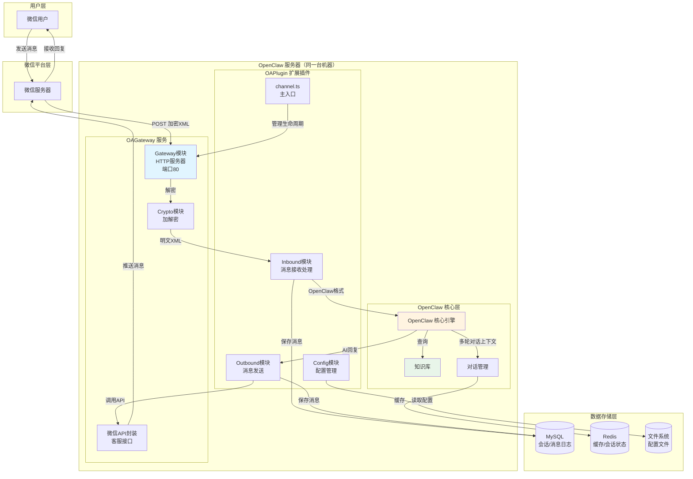

# OpenClaw 微信公众号客服助手 - 插件架构设计文档

**文档版本**: v2.0  
**撰写人**: OpenClaw Team  
**日期**: 2026-05-10  
**项目代号**: OAPlugin

---

## 目录

1. [系统架构设计](#一系统架构设计)
2. [插件架构设计](#二插件架构设计)
3. [消息流转设计](#三消息流转设计)
4. [配置管理设计](#四配置管理设计)
5. [部署方案设计](#五部署方案设计)
6. [数据库设计](#六数据库设计)
7. [接口设计](#七接口设计)
8. [安全和合规](#八安全和合规)
9. [性能和可靠性](#九性能和可靠性)
10. [兜底话术机制](#十兜底话术机制)
11. [实施路线图](#十一实施路线图)

---

## 一、系统架构设计

### 1.1 整体系统架构图（2.0版本）



**2.0版本关键变更**：
- OAGateway 与 OpenClaw 部署在同一台服务器
- 本地通信（localhost），避免网络复杂性
- 简化防火墙配置，提升安全性

---

## 二、插件架构设计

### 2.1 文件结构

```
openclaw-wechat/
├── openclaw.plugin.json          # 插件元数据
├── package.json                  # npm包描述
├── tsconfig.json                 # TypeScript配置
├── README.md                     # 安装使用说明
├── src/
│   ├── channel.ts                # 主入口 (ChannelPlugin接口)
│   ├── gateway.ts                # HTTP服务器 (接收微信推送)
│   ├── crypto.ts                 # 消息加解密 (AES-256-CBC)
│   ├── inbound.ts                # 接收消息处理 (XML→OpenClaw)
│   ├── outbound.ts               # 发送消息 (OpenClaw→微信)
│   ├── config.ts                 # 配置管理
│   ├── runtime.ts                # 运行时管理
│   ├── types.ts                  # TypeScript类型定义
│   ├── wechat-api.ts             # 微信API封装
│   └── utils/
│       ├── signature.ts          # 签名验证
│       ├── xml-parser.ts         # XML解析工具
│       └── logger.ts             # 日志工具
├── config/
│   ├── wechat-config.template.json   # 配置模板
│   └── .env.wechat.template         # 环境变量模板
├── dist/                         # 编译输出
└── tests/                        # 测试文件
```

---

## 三、消息流转设计

### 3.1 消息流转流程

```
微信用户发送消息
    ↓
微信服务器推送加密XML
    ↓
OAGateway 接收并解密
    ↓
转换为 OpenClaw 格式
    ↓
OpenClaw 核心处理（AI回复）
    ↓
转换为微信格式
    ↓
调用微信客服接口推送
    ↓
微信用户收到回复
```

### 3.2 异常处理流程

```
任何环节发生错误
    ↓
记录错误日志
    ↓
返回兜底话术给用户
    ↓
兜底话术："您的客服开了个小差，请稍后再试"
```

---

## 四、配置管理设计

### 4.1 配置文件结构

```json
{
  "version": "2.0.0",
  "server": {
    "host": "127.0.0.1",
    "port": 80,
    "publicUrl": "http://your-domain.com/wx/webhook"
  },
  "wechat": {
    "appId": "YOUR_APP_ID",
    "appSecret": "YOUR_APP_SECRET",
    "token": "YOUR_TOKEN",
    "encodingAESKey": "YOUR_AES_KEY"
  },
  "openclaw": {
    "apiUrl": "http://127.0.0.1:25265",
    "knowledgeBaseId": "kb-wechat-products",
    "apiTimeout": 10000
  }
}
```

---

## 五、部署方案设计

### 5.1 部署拓扑

```
【生产环境】
  OpenClaw服务器
  ├── OpenClaw核心
  ├── OAGateway (端口80)
  └── OAPlugin (扩展插件)
```

### 5.2 安装步骤

```bash
# 1. 安装 OAPlugin
openclaw plugin install openclaw-wechat

# 2. 配置 OAGateway
cp config/wechat-config.template.json config/wechat-config.json
# 编辑配置

# 3. 启动服务
openclaw plugin start wechat
```

---

## 六、数据库设计

### 6.1 会话表

```sql
CREATE TABLE wechat_sessions (
  id VARCHAR(64) PRIMARY KEY,
  openid VARCHAR(64) NOT NULL,
  app_id VARCHAR(32) NOT NULL,
  status ENUM('active', 'inactive') DEFAULT 'active',
  last_message_at TIMESTAMP,
  created_at TIMESTAMP DEFAULT CURRENT_TIMESTAMP,
  updated_at TIMESTAMP DEFAULT CURRENT_TIMESTAMP ON UPDATE CURRENT_TIMESTAMP
);
```

### 6.2 消息日志表

```sql
CREATE TABLE wechat_messages (
  id BIGINT AUTO_INCREMENT PRIMARY KEY,
  session_id VARCHAR(64) NOT NULL,
  openid VARCHAR(64) NOT NULL,
  msg_type VARCHAR(16) NOT NULL,
  content TEXT,
  direction ENUM('inbound', 'outbound') NOT NULL,
  status ENUM('success', 'failed') DEFAULT 'success',
  error_message TEXT,
  created_at TIMESTAMP DEFAULT CURRENT_TIMESTAMP
);
```

---

## 七、接口设计

### 7.1 OAGateway 接口

#### 7.1.1 微信服务器验证

```
GET /wx/webhook?signature=xxx&timestamp=xxx&nonce=xxx&echostr=xxx
```

#### 7.1.2 接收消息推送

```
POST /wx/webhook
Content-Type: text/xml
```

#### 7.1.3 健康检查

```
GET /health
```

### 7.2 微信客服接口

```
POST https://api.weixin.qq.com/cgi-bin/message/custom/send
```

---

## 八、安全和合规

### 8.1 消息加解密

- 支持 AES-256-CBC 加密
- 支持明文模式（测试环境）
- 支持安全模式（生产环境）

### 8.2 签名验证

- 所有微信消息必须验证签名
- 使用 Token + Timestamp + Nonce 生成签名

---

## 九、性能和可靠性

### 9.1 超时处理

| 环节 | 超时时间 | 处理方式 |
|------|----------|----------|
| 微信推送响应 | 5秒 | 立即返回 success |
| OpenClaw API | 10秒 | 返回兜底话术 |
| 微信客服接口 | 5秒 | 记录日志，不重试 |

### 9.2 异步处理

- 消息接收后立即返回 success
- 异步调用 OpenClaw 处理
- 异步推送回复到微信

---

## 十、兜底话术机制

### 10.1 设计目标

当 OpenClaw 处理失败时（LLM 问题、业务问题等），系统必须向用户返回友好的兜底话术，避免用户长时间等待无响应。

### 10.2 兜底话术内容

```
您的客服开了个小差，请稍后再试
```

### 10.3 触发条件

兜底话术在以下场景触发：

1. **OpenClaw API 调用超时**（超过 10 秒）
2. **OpenClaw API 返回错误**（HTTP 500/502/503）
3. **消息处理异常**（格式错误、解密失败等）
4. **任何未捕获的异常**
5. **Plugin 服务不可用**（连接失败）

### 10.4 实现位置

兜底话术在 **OAGateway** 的异常处理逻辑中实现：

```typescript
// src/gateway.ts
async function handleError(error: Error, openid: string): Promise<void> {
  logger.error("消息处理失败", { 
    error: error.message, 
    openid,
    stack: error.stack 
  });
  
  // 发送兜底话术
  await sendFallbackMessage(openid, "您的客服开了个小差，请稍后再试");
}
```

### 10.5 日志记录

兜底话术触发时，必须记录详细日志：

| 字段 | 说明 |
|------|------|
| error_type | 错误类型（timeout/api_error/exception） |
| openid | 用户 OpenID |
| original_message | 原始消息内容 |
| error_stack | 错误堆栈 |
| timestamp | 触发时间 |

### 10.6 监控告警

兜底话术触发频率超过阈值时，应触发告警：

- **警告阈值**：5 分钟内触发 > 10 次
- **严重阈值**：1 分钟内触发 > 10 次

告警方式：日志 + 企业微信/钉钉通知

---

## 十一、实施路线图

### 11.1 第一阶段（MVP）

- [x] OAGateway 基础功能（接收消息、验证签名）
- [x] 消息加解密（明文模式）
- [x] 与 OpenClaw 基础集成
- [ ] 兜底话术机制
- [ ] 健康检查接口

### 11.2 第二阶段（完善）

- [ ] 消息加密（安全模式）
- [ ] 多轮对话上下文
- [ ] 知识库集成
- [ ] 消息日志存储

### 11.3 第三阶段（优化）

- [ ] 性能优化（连接池、缓存）
- [ ] 监控告警
- [ ] 多公众号支持
- [ ] 灰度发布

---

**文档结束**

_本文档由 OpenClaw 项目团队维护_  
_最后更新: 2026-05-10_
